## Pregunta 1 - Catálogo comercial activo

**Enunciado:** Obtén los productos que no están descatalogados y cuyo precio unitario esté entre 10 y 50 euros, ambos incluidos. Muestra el nombre del producto y su precio redondeado a dos decimales, ordenado de mayor a menor precio.

**Consulta:**

```sql
SELECT product_name, ROUND(unit_price::numeric, 2)
FROM products
WHERE discontinued = 0 AND unit_price::numeric BETWEEN 10 AND 50
ORDER BY unit_price::numeric DESC;
```

**Resultado:** 

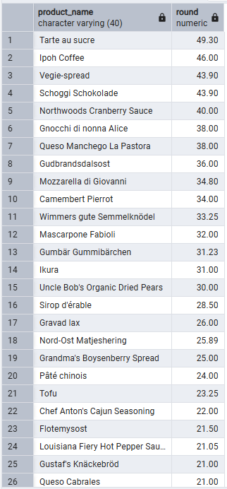

**Comentario:** Uso BETWEEN para indicar que el precio debe estar entre 10 y 50, y ROUND para mostrar el precio con dos decimales.

---

## Pregunta 2 - Concentración geográfica de la cartera

**Enunciado:** Cuenta cuántos clientes hay en cada país y muestra únicamente aquellos países con 5 o más clientes, ordenados de mayor a menor. Indica también cuántas ciudades distintas hay en cada uno de esos países.

**Consulta:**

```sql
SELECT 
    country AS pais, 
    COUNT(customer_id) AS num_clientes, 
    COUNT(DISTINCT city) AS num_ciudades
FROM 
    customers
GROUP BY 
    country
HAVING 
    COUNT(customer_id) >= 5
ORDER BY 
    num_clientes DESC;
```

**Resultado:**

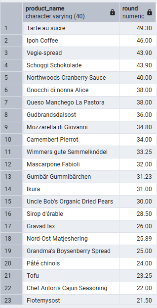

**Comentario:** Agrupo los clientes por país con GROUP BY y uso HAVING para quedarme solo con los países que tienen 5 o más clientes, ya que el filtro se aplica después de agrupar.

---

## Pregunta 3 — Alerta de reposición

**Enunciado:** Localiza los productos activos cuyas unidades en stock sean inferiores o iguales a su nivel de reposición. Muestra el nombre, las unidades en stock, el nivel de reposición, las unidades ya pedidas al proveedor y una columna de texto que indique 'CRÍTICO' cuando el stock sea 0 y 'AVISO' en el resto de casos.

**Consulta:**

```sql
SELECT 
    product_name AS producto, 
    units_in_stock AS stock, 
    reorder_level AS nivel_reposicion, 
    units_on_order AS pedido_a_proveedor,
    CASE 
        WHEN units_in_stock = 0 THEN 'CRÍTICO'
        ELSE 'AVISO'
    END AS situacion
FROM 
    products
WHERE 
    discontinued = 0 
    AND units_in_stock <= reorder_level;
```

**Resultado:**

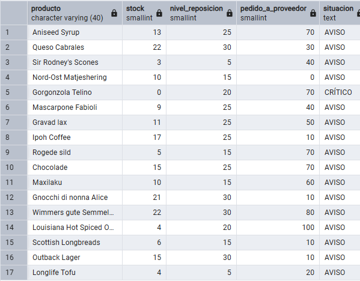

**Comentario:** Filtro los productos donde el stock es menor o igual al nivel de reposición, y uso un CASE para mostrar 'CRÍTICO' cuando el stock es 0 y 'AVISO' en los demás casos.

--- 

## Pregunta 4 - Ficha completa de producto

**Enunciado:** Para los productos suministrados por empresas de Italia, Francia o España, muestra el nombre del producto, el nombre de la categoría, el nombre del proveedor, su país y su ciudad. Ordena por país y, dentro de cada país, por nombre de producto.

**Consulta:**

```sql
SELECT p.product_name AS producto,
	c.category_name AS categoria,
	s.company_name AS proveedor,
	s.country AS pais,
	s.city AS ciudad
FROM 
	products p
INNER JOIN suppliers s ON p.supplier_id = s.supplier_id
INNER JOIN categories c ON p.category_id = c.category_id
WHERE s.country IN('Italy', 'Spain', 'French')
ORDER BY s.country ASC, 
p.product_name ASC;

```

**Resultado:**

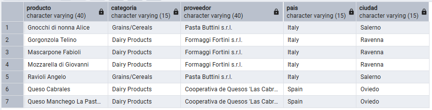

**Comentario:** Uso INNER JOIN para relacionar productos con su proveedor y su categoría, y filtro los países con IN para no repetir varias condiciones.

---

## Pregunta 5 - Detalle valorizado de un pedido

**Enunciado:** Atención al cliente recibe una reclamación sobre el pedido **10248** y necesita reconstruir la factura línea a línea.

Muestra, para ese pedido, el nombre del producto, el precio unitario aplicado, la cantidad, el descuento y el importe final de cada línea. Añade el nombre del cliente y la fecha del pedido.

**Consulta:**

```sql
SELECT contact_name AS cliente,
	o.order_date AS fecha_pedido,
	p.product_name AS producto,
	p.unit_price AS precio_unitario,
	d.quantity AS cantidad,
	d.discount AS descuento,
	ROUND((p.unit_price::numeric) * d.quantity * (1 - d.discount::numeric), 2) AS importe_linea
FROM 
	order_details AS d
INNER JOIN orders AS o USING(order_id)
INNER JOIN products AS p USING(product_id)
INNER JOIN customers AS c ON c.customer_id = o.customer_id
WHERE o.order_id = 10248
```

**Resultado:**

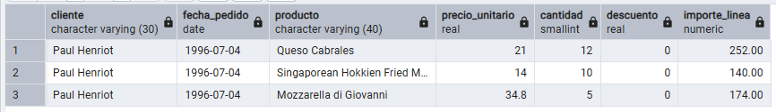

**Comentario:** Calculo el importe de cada línea multiplicando el precio por la cantidad y aplicando el descuento correspondiente.

---

## Pregunta 6

**Enunciado:** Comité de dirección: ¿qué familias de producto sostienen realmente el negocio?

Calcula la facturación total de cada categoría durante toda la historia de la compañía. Muestra el nombre de la categoría, el número de líneas de pedido que ha generado, el número de productos distintos vendidos y la facturación total. Incluye únicamente las categorías que superen los **100.000 euros** de facturación, ordenadas de mayor a menor.

**Consulta:**

```sql
SELECT c.category_name AS categoria,
	COUNT(od.order_id) AS num_lineas,
	COUNT(DISTINCT p.product_id) AS num_productos,
	ROUND(SUM(od.unit_price::numeric * od.quantity * (1 - od.discount::numeric)), 2) AS facturacion
FROM categories c
	JOIN products p ON c.category_id = p.category_id
	JOIN order_details od ON od.product_id = p.product_id
GROUP BY c.category_name
HAVING ROUND(SUM(od.unit_price::numeric * od.quantity * (1 - od.discount::numeric)), 2) > 100000
```

**Resultado:**

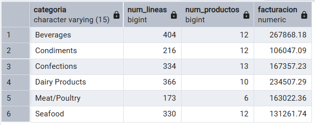

**Comentario:** Calculo la facturación multiplicando precio, cantidad y descuento, y uso HAVING para mostrar solo las categorías que superan los 100.000€.

---

## Pregunta 7 - Clientes sin actividad comercial

**Enunciado:** Lista todos los clientes con el número de pedidos que ha realizado cada uno y la fecha de su último pedido. Los clientes sin ningún pedido deben aparecer igualmente, con un 0 en el conteo y el texto 'SIN PEDIDOS' en lugar de la fecha. Ordena de forma que los clientes inactivos aparezcan primero.

**Consulta:**

```sql
SELECT c.contact_name AS cliente,
	c.country AS pais,
	COUNT(o.order_id) AS num_pedidos,
	COALESCE(MAX(o.order_date)::text, 'SIN PEDIDOS') AS ultimo_pedido
FROM customers c
	LEFT JOIN orders o USING(customer_id)
GROUP BY
	cliente, pais, c.customer_id
ORDER BY num_pedidos ASC;
```

**Resultado:**

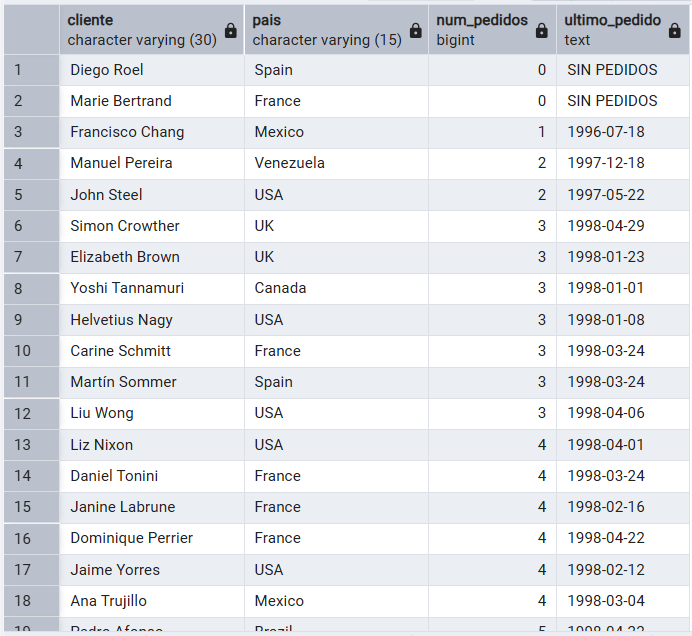

**Comentario:** Uso LEFT JOIN para incluir también a los clientes que no tienen pedidos, y COALESCE para mostrar 'SIN PEDIDOS' en lugar de un valor nulo.

---

## Pregunta 8 - Organigrama de la fuerza de ventas

**Enunciado:** Muestra cada empleado con su nombre completo, su cargo, el nombre completo de la persona a la que reporta y el cargo de esa persona. El empleado que no reporta a nadie debe aparecer también, con el texto 'DIRECCIÓN GENERAL' en el campo del responsable.

**Consulta:**

```sql
SELECT 
    emp.first_name || ' ' || emp.last_name AS empleado,
    emp.title AS cargo,
    COALESCE(jefe.first_name || ' ' || jefe.last_name, 'DIRECCIÓN GENERAL') AS responsable,
    COALESCE(jefe.title, 'DIRECCIÓN GENERAL') AS cargo_responsable
FROM 
    employees emp
LEFT JOIN 
    employees jefe ON emp.reports_to = jefe.employee_id;
```

**Resultado:**

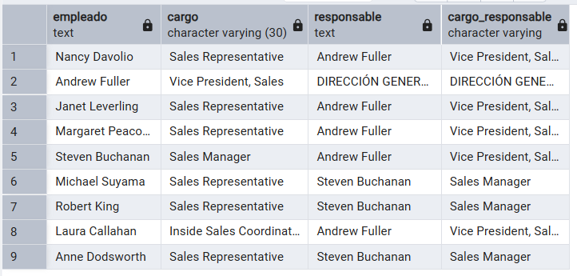

**Comentario:** Relaciono la tabla employees consigo misma con LEFT JOIN para obtener el jefe de cada empleado, y uso COALESCE para mostrar 'DIRECCIÓN GENERAL' cuando no tiene jefe.

---

## Pregunta 9 - Rejilla de cobertura categoría × año

**Enunciado:** Control de gestión quiere una rejilla completa de facturación por categoría y año, **sin huecos**: si una categoría no vendió nada en un año concreto, debe aparecer con un 0, no desaparecer de la tabla.

Genera todas las combinaciones posibles de las 8 categorías con los 3 años del histórico (24 filas) y asocia a cada combinación su facturación. Ordena por categoría y año.

**Consulta:**

```sql
SELECT 
    c.category_name AS categoria,
    a.anio AS anio,
    COALESCE(ROUND(SUM(od.unit_price * od.quantity * (1 - od.discount))::numeric, 2), 0) AS facturacion
FROM categories AS c
CROSS JOIN (
    SELECT DISTINCT EXTRACT(YEAR FROM order_date)::integer AS anio 
    FROM orders
) AS a
LEFT JOIN products AS p ON c.category_id = p.category_id
LEFT JOIN orders AS o ON EXTRACT(YEAR FROM o.order_date) = a.anio
LEFT JOIN order_details AS od ON p.product_id = od.product_id AND o.order_id = od.order_id
GROUP BY c.category_name, a.anio
ORDER BY categoria, anio;
```

**Resultado:**

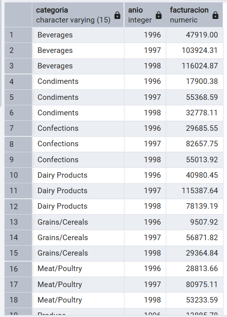

**Comentario:** Uso CROSS JOIN para generar todas las combinaciones de categoría y año, y LEFT JOIN con COALESCE para que las combinaciones sin ventas aparezcan con 0.

---

## Pregunta 10 - Mapa de países: clientes frente a proveedores

**Enunciado:** 

**Consulta:** Expansión internacional quiere una única tabla que muestre, para cada país en el que la compañía tiene presencia, cuántos clientes y cuántos proveedores hay. Deben aparecer los países que solo tienen clientes, los que solo tienen proveedores y los que tienen ambos.

```sql
SELECT 
    COALESCE(c.country, p.country) AS pais,
    COALESCE(c.num_clientes, 0) AS num_clientes,
    COALESCE(p.num_proveedores, 0) AS num_proveedores,
    CASE 
        WHEN COALESCE(c.num_clientes, 0) > 0 AND COALESCE(p.num_proveedores, 0) > 0 THEN 'AMBOS'
        WHEN COALESCE(c.num_clientes, 0) > 0 THEN 'SOLO CLIENTES'
        ELSE 'SOLO PROVEEDORES'
    END AS tipo_presencia
FROM (
    SELECT country, COUNT(customer_id) AS num_clientes
    FROM customers
    GROUP BY country
) c
FULL JOIN (
    SELECT country, COUNT(supplier_id) AS num_proveedores
    FROM suppliers
    GROUP BY country
) p ON c.country = p.country
ORDER BY pais;
```

**Resultado:**

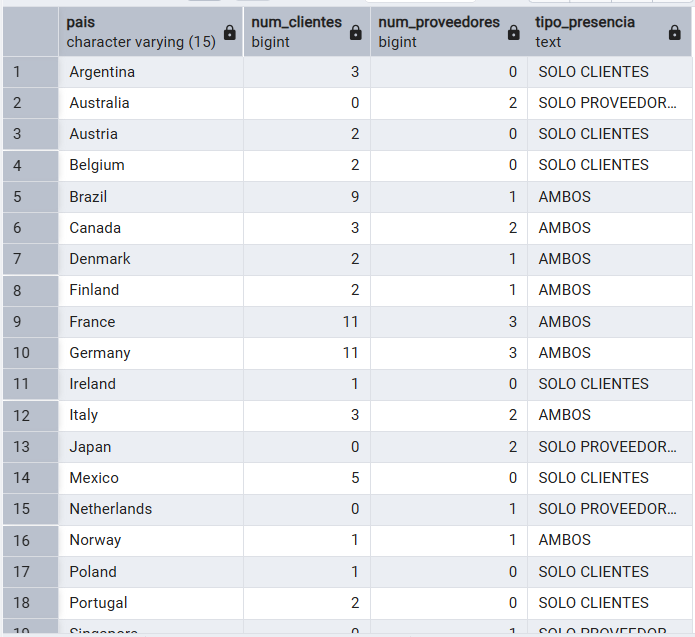

**Comentario:** Uso FULL JOIN para incluir los países que tienen clientes, proveedores o ambos, y COALESCE para evitar valores nulos en los conteos.

---

## Pregunta 11 - Directorio unificado de contactos

**Enunciado:** Sistemas va a migrar el CRM y necesita una exportación única con todos los contactos de la compañía, vengan de donde vengan.

Construye una sola tabla que reúna los contactos de clientes, los de proveedores y los empleados. Cada fila debe indicar el origen (`'CLIENTE'`, `'PROVEEDOR'`, `'EMPLEADO'`), el nombre de la persona de contacto **en mayúsculas**, la organización a la que pertenece, la ciudad y el país. Para los empleados, la organización es el literal `'NORTHWIND TRADERS'` y el nombre de contacto se forma concatenando nombre y apellidos.

Ordena por origen y luego por país.

**Consulta:**

```sql
SELECT 'CLIENTE' AS origen,
UPPER(contact_name) AS contacto,
company_name AS organizacion,
city AS ciudad,
country AS pais
FROM customers

UNION ALL

SELECT 'PROVEEDOR' AS origen,
UPPER(contact_name) AS contacto,
company_name AS organizacion,
city AS ciudad,
country AS pais
FROM suppliers

UNION ALL

SELECT 'EMPLEADO' AS origen,
UPPER(first_name ||' '|| last_name) AS contacto,
'NORTHWIND TRADERS' AS organizacion,
city AS ciudad,
country AS pais
FROM employees

ORDER BY origen, pais
```

**Resultado:**

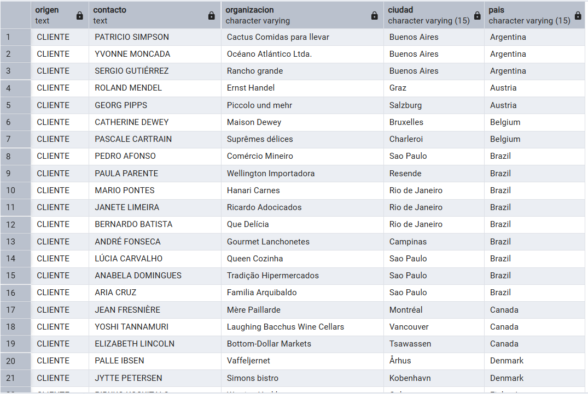

**Comentario:** Uso UNION ALL para unir los tres orígenes de contactos sin eliminar filas repetidas.

---

## Pregunta 12 - Mercados con desequilibrio

**Enunciado:** Compras y Ventas mantienen una discusión recurrente: ¿en qué países vendemos sin tener proveedor local, y en cuáles coincidimos?

Resuelve las dos preguntas en dos consultas independientes:

**a)** Países donde hay clientes pero **ningún** proveedor.
**b)** Países donde hay **a la vez** clientes y proveedores.

Ordena ambos resultados alfabéticamente.

**Consulta:**

```sql
SELECT country AS pais
FROM customers
EXCEPT
SELECT country AS pais
FROM suppliers
ORDER BY pais;

SELECT country AS pais
FROM customers
INTERSECT
SELECT country AS pais
FROM suppliers
ORDER BY pais;
```

**Resultado:**

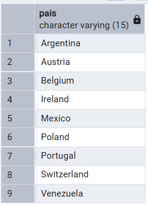
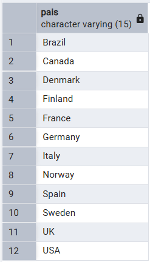

**Comentario:** Uso EXCEPT para obtener los países de clientes que no tienen proveedores, e INTERSECT para obtener los países que tienen ambos.

---

## Pregunta 13 - Clientes que nunca han comprado pescado

**Enunciado:** El responsable de la categoría Seafood quiere una lista de cuentas sobre las que hacer campaña de captación.

Localiza los clientes que **nunca** han incluido un producto de la categoría `'Seafood'` en ninguno de sus pedidos. Muestra el nombre del cliente, su país y el número total de pedidos que sí ha realizado, de mayor a menor.

**Consulta:**

```sql
SELECT c.contact_name AS cliente,
	c.country AS pais,
	COUNT(o.order_id) AS pedidos_realizados
FROM customers c
	JOIN orders o USING(customer_id)
WHERE NOT EXISTS (
	SELECT *
	FROM orders o2
    JOIN order_details od ON o2.order_id = od.order_id
    JOIN products p ON od.product_id = p.product_id
    JOIN categories cat ON p.category_id = cat.category_id
    WHERE o2.customer_id = c.customer_id
      AND cat.category_name = 'Seafood'
)
GROUP BY c.contact_name, c.country
ORDER BY pedidos_realizados DESC;
```

**Resultado:**

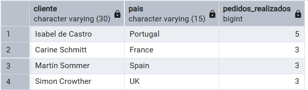

**Comentario:** Uso NOT EXISTS para excluir a los clientes que han comprado algún producto de la categoría Seafood.

---

## Pregunta 14 - Productos por encima de la media

**Enunciado:** El comité de precios quiere identificar el segmento premium del catálogo.

Muestra los productos activos cuyo precio unitario supere el precio medio de **todo** el catálogo. Incluye en cada fila el precio del producto, el precio medio general y la diferencia entre ambos, todo redondeado a dos decimales. Ordena por diferencia descendente.

**Consulta:**

```sql
SELECT 
    product_name AS producto,
    unit_price AS precio,
    (SELECT AVG(unit_price) FROM products) AS precio_medio_catalogo,
    ROUND((unit_price - (SELECT AVG(unit_price) FROM products))::numeric, 2) AS diferencia
FROM products
WHERE discontinued = 0
    AND unit_price > (SELECT AVG(unit_price) FROM products)
ORDER BY diferencia DESC;
```

**Resultado:**

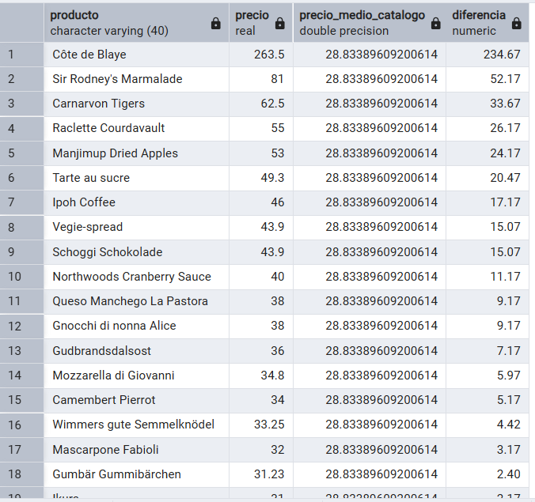

**Comentario:** Calculo el precio medio con una subconsulta y lo comparo con el precio de cada producto para mostrar solo los que están por encima de la media.

---

## Pregunta 15 - Ticket medio por cliente

**Enunciado:** Dirección comercial quiere segmentar la cartera por valor medio de pedido, no por volumen total.

Calcula, para cada cliente que haya comprado alguna vez, el número de pedidos, el importe total acumulado y el importe medio por pedido. Muestra los 15 clientes con mayor ticket medio.

El cálculo tiene dos niveles: primero hay que obtener el importe de cada pedido sumando sus líneas, y solo después promediar esos importes por cliente. **Promediar directamente las líneas daría un resultado distinto y equivocado.**

**Consulta:**

```sql
SELECT 
    c.contact_name AS cliente,
    c.country AS pais,
    COUNT(sub.importe_pedido) AS num_pedidos,
    SUM(sub.importe_pedido) AS importe_total,
    AVG(sub.importe_pedido) AS ticket_medio
FROM (
    SELECT 
        o.customer_id,
        SUM(od.unit_price * od.quantity) AS importe_pedido
    FROM orders o
    JOIN order_details od ON o.order_id = od.order_id
    GROUP BY o.order_id, o.customer_id
) AS sub
JOIN customers c ON sub.customer_id = c.customer_id
GROUP BY c.contact_name, c.country
ORDER BY ticket_medio DESC
LIMIT 15;
```

**Resultado:**

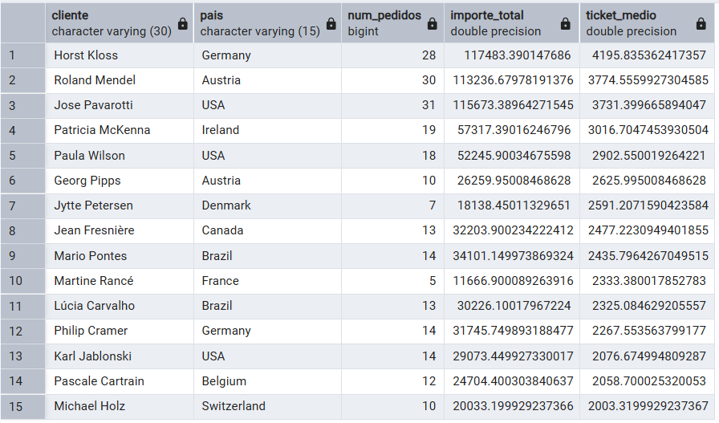

**Comentario:** Primero calculo el importe total de cada pedido y después obtengo la media de esos importes por cliente, ya que promediar directamente las líneas daría un resultado incorrecto.

---

## Pregunta 16 - El producto más caro de cada categoría

**Enunciado:** El equipo de compras quiere revisar el posicionamiento de precio en cada familia.

Para cada categoría, muestra el producto con el precio unitario más alto. Incluye el nombre de la categoría, el nombre del producto, su precio y el precio medio de su categoría.

Resuélvelo con una **subconsulta correlacionada**: para cada producto, comprueba si su precio coincide con el máximo de su propia categoría.

**Consulta:** 

```sql
SELECT c.category_name AS categoria,
	p.product_name AS producto,
	p.unit_price AS precio,
	(SELECT AVG(p3.unit_price) 
	    FROM products p3 
	    WHERE p3.category_id = p.category_id
	) AS precio_medio_categoria

FROM products p
JOIN categories c ON p.category_id = c.category_id
WHERE p.unit_price = (
    SELECT MAX(p2.unit_price) 
    FROM products p2 
    WHERE p2.category_id = p.category_id
)
```

**Resultado:**

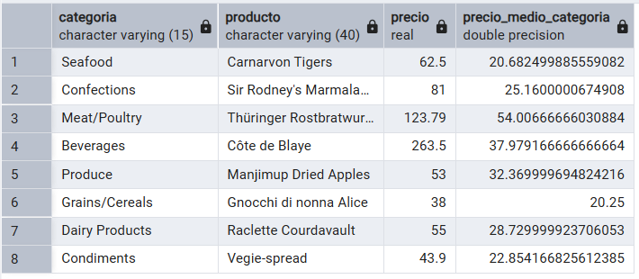

**Comentario:** Uso una subconsulta para comparar el precio de cada producto con el precio máximo de su categoría y así obtener el producto más caro de cada una.

---

## Pregunta 17 - Segmentación ABC de la cartera de clientes

**Enunciado:** Dirección quiere clasificar a los clientes en tres tramos de valor para asignar recursos comerciales.

Usando expresiones de tabla común (CTE), construye una consulta que:

1. Calcule la facturación total de cada cliente.
2. Divida los clientes en **cuartiles** según esa facturación.
3. Asigne una etiqueta de segmento: `'A - Estratégico'` al cuartil superior, `'B - Consolidado'` al segundo, `'C - Ocasional'` al tercero y `'D - Marginal'` al cuarto.
4. Devuelva, por segmento, el número de clientes, la facturación total del segmento y el porcentaje que representa sobre el total de la compañía.

**Consulta:**

```sql
WITH facturacion_clientes AS (
    -- Paso 1: Calculamos la facturación total de cada cliente
    SELECT 
        c.customer_id,
        c.contact_name AS cliente,
        SUM(od.unit_price * od.quantity) AS facturacion_total
    FROM customers c
    JOIN orders o ON c.customer_id = o.customer_id
    JOIN order_details od ON od.order_id = o.order_id
    GROUP BY c.customer_id, c.contact_name
),
segmentos AS (
    -- Paso 2: Dividimos en 4 cuartiles (de mayor a menor) y asignamos la etiqueta comercial
    SELECT 
        cliente,
        facturacion_total,
        CASE NTILE(4) OVER (ORDER BY facturacion_total DESC)
            WHEN 1 THEN 'A - Estratégico'
            WHEN 2 THEN 'B - Consolidado'
            WHEN 3 THEN 'C - Ocasional'
            WHEN 4 THEN 'D - Marginal'
        END AS segmento
    FROM facturacion_clientes
)
-- Paso 3: Consulta final para resumir por segmento, contar clientes, sumar dinero y sacar el porcentaje
SELECT 
    segmento,
    COUNT(cliente) AS num_clientes,
    ROUND(SUM(facturacion_total)::numeric, 2) AS facturacion_segmento,
    ROUND(
        (SUM(facturacion_total) * 100.0 / (SELECT SUM(facturacion_total) FROM facturacion_clientes))::numeric, 
        2
    ) AS porcentaje_sobre_total
FROM segmentos
GROUP BY segmento
ORDER BY segmento;
```

**Resultado:**

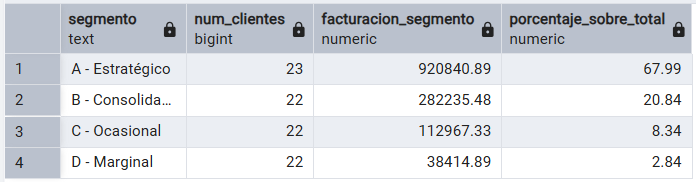

**Comentario:** Uso NTILE(4) para dividir a los clientes en cuatro grupos según su facturación y un CASE para asignar la etiqueta de segmento correspondiente.

---

## Pregunta 18 - Los tres productos más vendidos de cada categoría

**Enunciado:** El equipo de categoría necesita el podio de cada familia para negociar con proveedores.

Para cada categoría, obtén los **tres productos con mayor facturación**. Muestra la categoría, la posición dentro de la categoría, el nombre del producto, las unidades vendidas y la facturación.

Incluye además una columna con la posición global del producto en el conjunto de la compañía, para que se vea qué productos son líderes de su nicho pero irrelevantes en el total.

**Consulta:**

```sql
WITH ranking_productos AS (
    SELECT 
        c.category_name AS categoria,
        p.product_name AS producto,
        SUM(od.quantity) AS unidades,
        SUM(od.unit_price * od.quantity) AS facturacion,
        -- Ranking dentro de su propia categoría (el podio)
        RANK() OVER (PARTITION BY c.category_name ORDER BY SUM(od.unit_price * od.quantity) DESC) AS posicion_en_categoria,
        -- Ranking global en toda la empresa
        RANK() OVER (ORDER BY SUM(od.unit_price * od.quantity) DESC) AS posicion_global
    FROM categories c
    JOIN products p ON c.category_id = p.category_id
    JOIN order_details od ON p.product_id = od.product_id
    GROUP BY c.category_name, p.product_name
)
SELECT 
    categoria,
    posicion_en_categoria,
    producto,
    unidades,
    ROUND(facturacion::numeric, 2) AS facturacion,
    posicion_global
FROM ranking_productos
WHERE posicion_en_categoria <= 3
ORDER BY categoria, posicion_en_categoria;
```

**Resultado:**

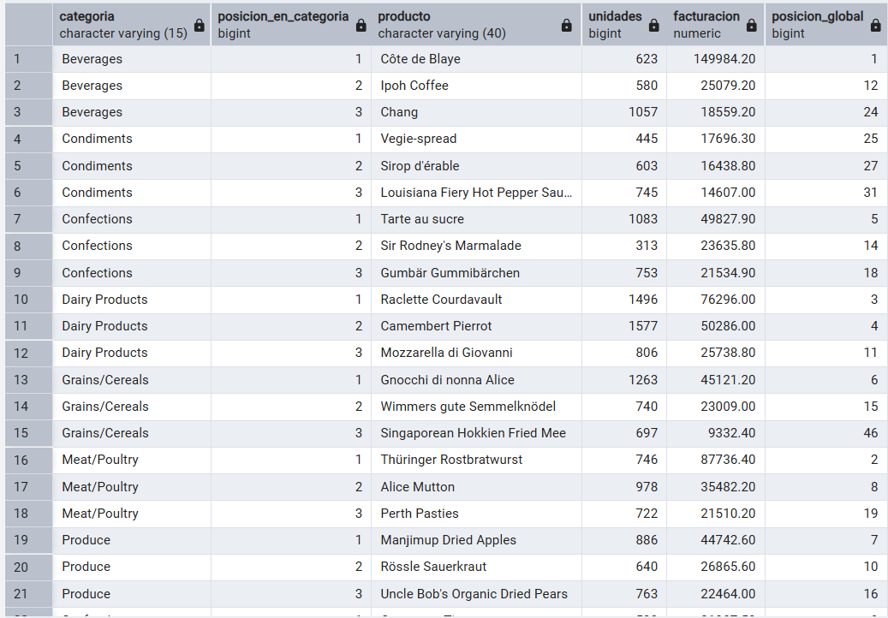

**Comentario:** Uso RANK() con PARTITION BY para ordenar los productos dentro de cada categoría, y otro RANK() para mostrar su posición general en la empresa.

---

## Pregunta 19 - Evolución mensual con acumulado y media móvil

**Enunciado:** Control de gestión prepara el cuadro de mando de la evolución del negocio durante 1997.

Para cada mes de 1997, calcula:

- La facturación del mes.
- El total acumulado desde enero.
- La media móvil de los tres últimos meses (el mes actual y los dos anteriores).
- La facturación del mes anterior.
- La variación porcentual respecto al mes anterior.

**Consulta:**

```sql
WITH ventas_mensuales AS (
    SELECT 
        DATE_TRUNC('month', o.order_date)::date AS mes,
        SUM(od.unit_price * od.quantity) AS facturacion
    FROM orders o
    JOIN order_details od ON o.order_id = od.order_id
    WHERE EXTRACT(YEAR FROM o.order_date) = 1997
    GROUP BY DATE_TRUNC('month', o.order_date)
)
SELECT 
    mes,
    ROUND(facturacion::numeric, 2) AS facturacion,
    ROUND(SUM(facturacion) OVER (ORDER BY mes)::numeric, 2) AS acumulado,
    ROUND(AVG(facturacion) OVER (
        ORDER BY mes 
        ROWS BETWEEN 2 PRECEDING AND CURRENT ROW
    )::numeric, 2) AS media_movil_3m,
    ROUND(LAG(facturacion) OVER (ORDER BY mes)::numeric, 2) AS mes_anterior,
    ROUND((
        (facturacion - LAG(facturacion) OVER (ORDER BY mes)) * 100.0 
        / LAG(facturacion) OVER (ORDER BY mes)
    )::numeric, 2) AS variacion_pct
FROM ventas_mensuales
ORDER BY mes;
```

**Resultado:**

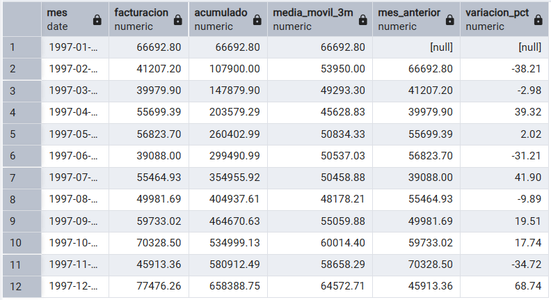

**Comentario:** Uso funciones de ventana para calcular el acumulado, la media móvil de tres meses y la comparación con el mes anterior mediante LAG().

---

## Pregunta 20 - Cuadro de mando anual por categoría

**Enunciado:** Última petición, y la más ambiciosa: el informe anual que se presenta al consejo.

Construye una tabla donde cada fila sea una categoría y las columnas muestren la facturación de 1996, 1997 y 1998 en columnas separadas, más el total de los tres años. Añade al final una fila de totales generales.

Incluye además una columna que indique el peso de cada categoría sobre la facturación total de la compañía, y otra que muestre si la categoría creció o decreció entre 1997 y 1998.

**Consulta:**

```sql
WITH ventas_anuales AS (
    SELECT 
        c.category_name AS categoria,
        EXTRACT(YEAR FROM o.order_date) AS anio,
        SUM(od.unit_price * od.quantity) AS importe
    FROM categories c
    JOIN products p ON c.category_id = p.category_id
    JOIN order_details od ON p.product_id = od.product_id
    JOIN orders o ON od.order_id = o.order_id
    GROUP BY c.category_name, EXTRACT(YEAR FROM o.order_date)
),
tabla_pivot AS (
    SELECT 
        categoria,
        COALESCE(SUM(importe) FILTER (WHERE anio = 1996), 0) AS f_1996,
        COALESCE(SUM(importe) FILTER (WHERE anio = 1997), 0) AS f_1997,
        COALESCE(SUM(importe) FILTER (WHERE anio = 1998), 0) AS f_1998,
        COALESCE(SUM(importe), 0) AS total
    FROM ventas_anuales
    GROUP BY ROLLUP(categoria)
)
SELECT 
    COALESCE(categoria, 'TOTAL GENERAL') AS categoria,
    ROUND(f_1996::numeric, 2) AS f_1996,
    ROUND(f_1997::numeric, 2) AS f_1997,
    ROUND(f_1998::numeric, 2) AS f_1998,
    ROUND(total::numeric, 2) AS total,
    ROUND((total * 100.0 / SUM(total) OVER())::numeric, 2) AS peso_pct,
        CASE 
        WHEN categoria IS NULL THEN '-'
        WHEN f_1998 > f_1997 THEN 'Creció'
        ELSE 'Decreció'
    END AS tendencia
FROM tabla_pivot
ORDER BY categoria NULLS LAST;
```

**Resultado:**

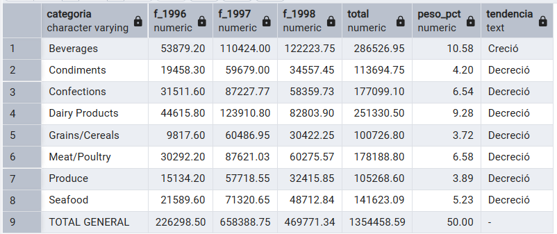

**Comentario:** Uso FILTER para separar la facturación por año en columnas y ROLLUP para añadir la fila de totales al final.

